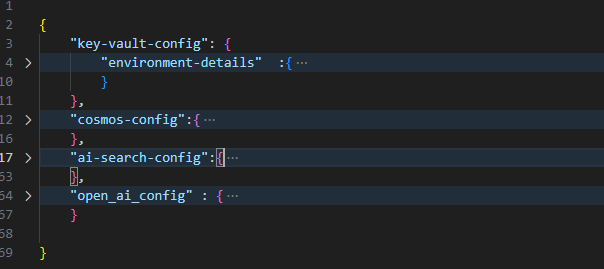

# Creating Azure AI Search Index to scan the data from Azure Cosmos DB

## Objective
In this example, we will upload a sample data into cosmsos db and create an index in Azure AI Search to scan the data from cosmos db. While creating the Azure AI Search Index we will also create the other associated resources like Skillset, Indexer, Data Source, and Vectorizer.

## Prerequisites
1. You already have an Active Azure Subscription.
2. You have a python virtual environment where the required modules are already installed (requirements.txt). If you do not have the virtual environment, you can create one using the below command.

```bash
python -m venv < virtual environment name>
```
3. Install the packages that are required to run the script. You can install the packages using the below command.

```bash 
pip install -r requirements.txt
```

5. You have following resources are already provisioned. 
    - Azure Cosmos DB
    - Azure AI Search
    - Azure Open AI
    

## configurations

We have two configurations files to update. 

### .env file

- COSMOS_ENDPOINT="https://XXXXXXXXXXXXXX-cosmosdb.documents.azure.com/"
- TENANT_ID="" [**Optional**] ( If you are using your own credential or Managed Identity to authenticate, you can keep this empty)
- CLIENT_ID="" [**Optional**] ( If you are using your own credential or Managed Identity to authenticate, you can keep this empty) 
- CLIENT_SECRET="" [**Optional**] ( If you are using your own credential or Managed Identity to authenticate, you can keep this empty)
- AZURE_SEARCH_ENDPOINT="https://XXXXXX-search1.search.windows.net"
- COSMOS_DB_CONNECTION_STRING="ResourceId=/subscriptions/XXXXX/resourceGroups/XXXXXXXXXXXXXX/providers/Microsoft.DocumentDB/databaseAccounts/XXXXXX;Database=catalogDb;IdentityAuthType=AccessToken"
- OPEN_AI_ENDPOINT="https://XXXXXX-openai.openai.azure.com/"
- MI_CLIENT_ID="" [**Optional**] ( If you are using your own credential or Service Principal to authenticate, you can keep this empty)

The sample .env file is available in the repository. You can rename the .env_sample to .env and update the values.

### Search Config
`AzureSearch\config\config.json`

The whole configurations are divided into 4 parts.



- **Key vault config** : This is optional, we can keep this value blank if we are using the .env file for storing the secrets. Incase we are storing the secrets in the Azure Key Vault, we can update the key vault name and the secrets name in this config. Also for this we need to uncomment sections in the python script which reads the secrets from the key vault.
- **Cosmos config** : this portion contains the cosmos db configurations like cosmos db name, container name, partition key, and the fields which we want to index.
- **Search config** : This portion contains the Azure AI Search configurations like search service name, index name, indexer name, skillset name, and the fields which we want to index.
- **Open AI config** : This portion contains the Open AI configurations like open ai endpoint, model deployment name.


## Uploading the data to Cosmos DB

`AzureSearch\uploadDatatoCosmosDB.py`

**RBAC Permissions** required to run the script:
- The agent or user who is running the script should have the following permissions on the cosmos db.
    - [Cosmos DB Data Contributor Role](https://learn.microsoft.com/en-us/azure/cosmos-db/how-to-setup-rbac#built-in-role-definitions) : We can use the powershell script `AzureSearch\roleassignmentCosmosDB\roleasignments.ps1` to assign the role to the user or service principal.
  

Here are the steps that we perform in the scripts.

- read the environment variable either from .env file or key vault. 
- authentication is done either using Default credential or Service Principal.
- Read the data from the sample data file.
- Upload the data to cosmos db.

## Creating the Azure AI Search Objects

**RBAC Permissions** required to run the script: 
- The agent or user who is running the script should have the following permissions on the Azure AI Search.
    - Search Service Contributor (7ca78c08-252a-4471-8644-bb5ff32d4ba0) 
- For the Search Service managed identity to access the data in cosmos db should have Cosmos Db Account Reader Role(fbdf93bf-df7d-467e-a4d2-9458aa1360c8). 
    - [Cosmos DB Data Reader Role](https://learn.microsoft.com/en-us/azure/cosmos-db/how-to-setup-rbac#built-in-role-definitions)
